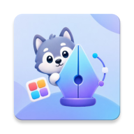

<p align="center">
  
</p>

<h1 align="center">Perficon</h1>

<p align="center">
  <em>设计、导出，属于你自己的 Android 图标包。</em>
  <br />
  <em>Design and export your own Android icon pack — no coding required.</em>
</p>

<p align="center">
  
  
  
  
  
</p>

---

## 目录 / Table of Contents

- [简介 / Introduction](#简介--introduction)
- [功能亮点 / Features](#功能亮点--features)
- [截图预览 / Screenshots](#截图预览--screenshots)
- [架构设计 / Architecture](#架构设计--architecture)
- [技术栈 / Tech Stack](#技术栈--tech-stack)
- [项目结构 / Project Structure](#项目结构--project-structure)
- [构建指南 / Build Guide](#构建指南--build-guide)
- [使用许可 / License](#使用许可--license)
- [致谢 / Acknowledgments](#致谢--acknowledgments)

---

## 简介 / Introduction

**Perficon** 是一款 Android 原生应用，让你无需编写一行代码，即可在手机上完成图标包的设计、预览与导出。它支持**静态图标映射**、**动态日历图标**（31 天日期切换）和**动态时钟图标**（表盘指针旋转）——所有导出包均兼容主流第三方 Launcher（如 Lawnchair、Nova、Hyperion 等）。

> **Perficon** is a native Android app that lets you design, preview, and export complete icon packs — all from your phone. It supports static icon mapping, dynamic calendar icons (31-day switching), and dynamic clock icons (rotating hands). All exported APKs are compatible with popular third-party launchers like Lawnchair, Nova, Hyperion, and more.

---

## 功能亮点 / Features

### 静态图标映射
- 从图库或文件管理器为任意应用选择图标
- 支持批量快速生成
- 自动解析已安装应用的启动 Activity
- 支持图标名称、包名、目标 Activity 编辑

### 动态日历图标
- 一键生成 1–31 日的日期图标序列
- 自定义每一天的日期图标素材
- 自动展开为 CandyBar 兼容的日历组件映射
- 覆盖 20+ 主流日历应用（Google 日历、三星日历、小米日历等）

### 动态时钟图标
- 表盘背景 + 时针 / 分针 / 秒针四层独立编辑
- 一键恢复缺省图层
- 自动展开为 30+ 时钟应用映射（系统时钟、Google 时钟、OnePlus 时钟等）

### 图标包导出
- 内置模板引擎，自动生成完整 APK
- 智能资源去重：相同素材的日历 / 时钟自动共享模板槽位
- 自动签名（V1 + V2 + V3）
- 二进制 `appfilter.xml` 与 `drawable.xml`，兼容 Lawnchair 等资源型 Launcher
- 导出至系统下载目录，支持一键安装

### 更多特性
- 导入已安装的第三方图标包进行二次编辑
- 项目复制、删除管理
- 中 / 英双语界面，适配系统语言
- 像素风复古 UI（Fusion Pixel 10px 字体）
- 图标蒙版、叠层、背景自定义

---

## 截图预览 / Screenshots

> *即将补充应用截图。敬请期待。*

---

## 架构设计 / Architecture

Perficon 采用 **MVVM + Clean Architecture** 分层设计：

```
┌─────────────────────────────────────────┐
│  UI Layer (Jetpack Compose)             │
│  ├─ ProjectListScreen                   │
│  ├─ ProjectEditorScreen                 │
│  └─ Components (RetroButton, etc.)      │
├─────────────────────────────────────────┤
│  ViewModel Layer                        │
│  └─ IconPackViewModel                   │
├─────────────────────────────────────────┤
│  Repository Layer                       │
│  └─ IconPackRepository                  │
├─────────────────────────────────────────┤
│  Data Layer                             │
│  ├─ Room Database (IconPackProject,     │
│  │   IconMapping)                       │
│  └─ File System (Perficon/ 目录)        │
├─────────────────────────────────────────┤
│  Core Utilities                         │
│  ├─ ApkGenerator (APK 构建引擎)         │
│  ├─ BinaryAppFilterWriter (二进制 XML)  │
│  ├─ BinaryDrawableXmlWriter             │
│  ├─ ApkSignerUtil (V1/V2/V3 签名)       │
│  ├─ ApkManifestEditor (Manifest 编辑)   │
│  ├─ DynamicIconAssets (动态资源管理)     │
│  └─ IconPackImporter (导入引擎)         │
└─────────────────────────────────────────┘
```

### 图标包导出流程

```
项目数据 + 图标映射
       │
       ▼
  ApkGenerator.generateApk()
       │
       ├─ 1. 加载 template-app 编译的 base.apk 模板
       ├─ 2. 扫描模板槽位 (30,000 静态 + 64 日历 + 64 时钟)
       ├─ 3. 资源去重：相同素材的日历/时钟共享槽位
       ├─ 4. 替换图标 → 生成二进制 appfilter.xml / drawable.xml
       ├─ 5. 修改 AndroidManifest.xml（包名、版本号、应用名）
       ├─ 6. 移除原签名文件
       ├─ 7. V1+V2+V3 签名
       └─ 8. 导出到系统下载目录
```

### 模板系统 (template-app)

`template-app` 子模块是一个独立的 Android 应用，作为图标包的结构模板：

| 资源类型 | 容量 | 说明 |
|---------|------|------|
| 静态图标槽位 | 60,000 | `res/drawable-nodpi-v5/icon_N.png` |
| 动态日历槽位 | 64 组 | `calendar_N_M.png`（每组 31 天） |
| 动态时钟槽位 | 64 组 | `clock_N_bg/hour/minute/second.png` + `clock_dynamic_N.xml` |

构建时通过 Gradle 任务自动生成占位 PNG 和 XML 资源，再编译为 `base.apk` 嵌入主应用。

---

## 技术栈 / Tech Stack

| 类别 | 技术 |
|------|------|
| 语言 | Kotlin |
| UI 框架 | Jetpack Compose + Material 3 |
| 架构 | MVVM + Clean Architecture |
| 本地数据库 | Room (SQLite) |
| 异步处理 | Kotlin Coroutines + Flow |
| 图片加载 | Coil |
| APK 签名 | `apksig` + BouncyCastle |
| 二进制 XML | 自定义 Writer（`BinaryAppFilterWriter`、`BinaryDrawableXmlWriter`） |
| 构建系统 | Gradle (Kotlin DSL) + AAPT2 |

---

## 项目结构 / Project Structure

```
Perficon/
├── app/                          # 主应用模块
│   └── src/main/
│       ├── assets/
│       │   └── base.apk          # 图标包模板（由 template-app 构建）
│       ├── java/com/kian/perficon/
│       │   ├── MainActivity.kt   # 主入口
│       │   ├── model/            # 数据模型（Room Entity）
│       │   ├── repository/       # 数据仓库层
│       │   ├── viewmodel/        # ViewModel 层
│       │   ├── ui/               # Compose UI 层
│       │   │   ├── theme/        # 主题（Color, Type, Theme）
│       │   │   ├── components/   # 可复用组件
│       │   │   └── AppLanguage.kt # 双语本地化
│       │   └── util/             # 核心工具
│       │       ├── ApkGenerator.kt           # APK 构建引擎
│       │       ├── ApkSignerUtil.kt          # V1/V2/V3 签名
│       │       ├── ApkManifestEditor.kt      # 二进制 Manifest 编辑
│       │       ├── BinaryAppFilterWriter.kt  # 二进制 appfilter.xml
│       │       ├── BinaryDrawableXmlWriter.kt# 二进制 drawable.xml
│       │       ├── DynamicIconAssets.kt      # 动态图标资源管理
│       │       ├── DynamicIconDefaults.kt    # 日历/时钟应用预设
│       │       ├── IconPackImporter.kt       # 图标包导入
│       │       ├── FileHelper.kt             # 文件操作
│       │       └── StorageHelper.kt          # 存储路径管理
│       └── res/
│           ├── font/             # Fusion Pixel 字体
│           ├── values/           # 字符串资源
│           └── mipmap/           # 应用图标
│
├── template-app/                 # 图标包模板子模块
│   └── src/main/
│       ├── java/com/kian/perficontemplate/
│       │   └── ui/theme/        # 模板主题
│       └── res/
│           ├── drawable-nodpi-v5/  # 占位图标资源
│           ├── drawable/           # 动态时钟 XML
│           ├── xml/                # drawable.xml
│           └── font/               # 字体（从 app 复制）
│
├── build.gradle.kts              # 根构建配置
├── settings.gradle.kts           # 项目设置
└── gradle/                       # Gradle Wrapper
```

---

## 构建指南 / Build Guide

### 环境要求

- Android Studio Hedgehog (2023.1.1) 或更高版本
- JDK 17+
- Android SDK 36
- Gradle 8.x

### 构建步骤

```bash
# 1. 克隆仓库
git clone https://github.com/Kian-Android/Perficon.git
cd Perficon

# 2. 构建图标包模板 APK
./gradlew :template-app:assembleDebug copyTemplateApk

# 3. 构建主应用
./gradlew :app:assembleDebug
```

生成的 APK 位于 `app/build/outputs/apk/debug/app-debug.apk`。

> **注意**：首次构建必须先运行 `copyTemplateApk` 任务，将模板 APK 复制到 `app/src/main/assets/base.apk`。后续修改模板后需重新运行此任务。

---

## 使用许可 / License

本项目采用 [**CC BY-NC-SA 4.0**](https://creativecommons.org/licenses/by-nc-sa/4.0/)（署名-非商业性使用-相同方式共享 4.0 国际）许可协议。

| 允许 | 禁止 |
|------|------|
| 自由分享、复制、分发 | 商业用途 |
| 二次修改、演绎、再创作 | 未署名使用 |
| | 衍生作品使用不兼容的许可 |

**二次修改必须注明原作者（Kian），并以相同许可协议发布。**

完整许可文本见 [LICENSE](LICENSE)。

---

## 致谢 / Acknowledgments

- **[Fusion Pixel 10px](https://fusion-pixel.com/)** — 本项目使用的中文像素字体，由 [TakWolf](https://github.com/TakWolf) 创作并维护。Fusion Pixel 以像素风格融合汉字与拉丁字符，为 Perficon 提供了独特的复古视觉体验。
- **[CandyBar](https://github.com/zixpo/candybar)** — 图标包规范参考，动态日历/时钟的组件映射体系受其启发。
- **[apksig](https://developer.android.com/tools/apksig)** — Android APK 签名库，用于自动签名导出的图标包。
- **[BouncyCastle](https://www.bouncycastle.org/)** — 加密库，用于生成自签名证书。
- **[Coil](https://coil-kt.github.io/coil/)** — Kotlin 优先的 Android 图片加载库。
- **[Room](https://developer.android.com/training/data-storage/room)** — Android 官方 ORM，用于项目与映射数据的持久化。

---

<p align="center">
  <sub>Made with ❤️ by <a href="https://github.com/Kian-Android">Kian</a></sub>
</p>
